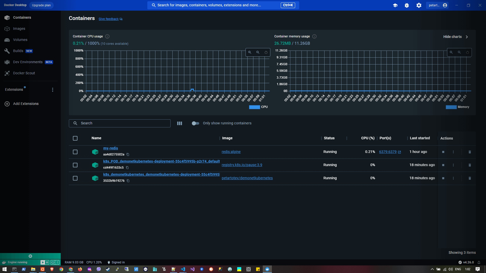
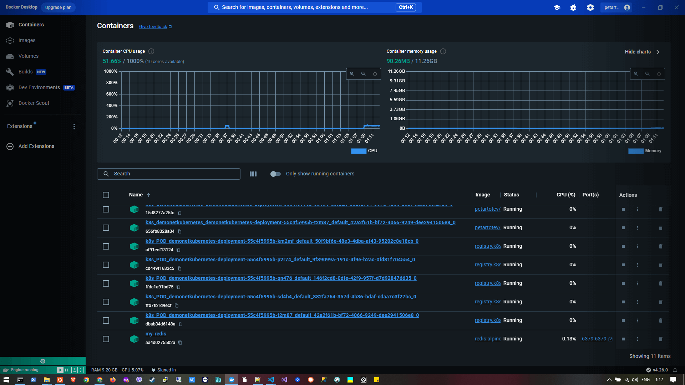

# PT_Demo_NET_Kubernetes

## Contents

- [Prerequisites](#prerequisites)
- [Setup](#setup)
- [Add Horizontal Pod Autoscaling](#add-horizontal-pod-autoscaling-hpa)
- [Use Helm Chart](#using-helm-chart)
- [Teardown](#teardown)
- [Commands](#commands)
- [Terms](#terms)
- [Links](#links)

## Prerequisites

1. Install `Docker Desktop`.

2. Enable `Kubernetes` in Docker Desktop:
```
Docker Desktop > Settings > Kubernetes > [v] Enable Kubernetes
```

3. Check that you have `kubectl` CLI by using any of the following commands:
```
kubectl version
kubectl --help
```

4. Install `Helm` from [here](https://helm.sh/docs/intro/install/).

On Windows, open Power Shell `as Admin` and execute the following command:

```
choco install kubernetes-helm
```

5. Check that you have `helm` CLI installed by using any of the following commands:
```
helm version
helm --help
```

## Setup

1. Create a new .NET blank solution `PT_Demo_NET_Kubernetes`.

2. Create a new .NET Web API project `DemoNetKubernetes`.

3. Introduce CpuController and MemoryController having endpoints that process CPU / Memory intensive workloads.

4. Create `Dockerfile` in the DemoNetKubernetes.csproj directory:
```
FROM mcr.microsoft.com/dotnet/aspnet:6.0 AS base
WORKDIR /app
EXPOSE 80
EXPOSE 443

FROM mcr.microsoft.com/dotnet/sdk:6.0 AS build
WORKDIR /src
COPY ["DemoNetKubernetes.csproj", "./"]
RUN dotnet restore "DemoNetKubernetes.csproj"
COPY . .
WORKDIR "/src/"
RUN dotnet build "DemoNetKubernetes.csproj" -c Release -o /app/build

FROM build AS publish
RUN dotnet publish "DemoNetKubernetes.csproj" -c Release -o /app/publish

FROM base AS final
WORKDIR /app
COPY --from=publish /app/publish .
ENTRYPOINT ["dotnet", "DemoNetKubernetes.dll"]
```

5. Build `Docker Image` and push it in Docker Hub:

```
docker build -t petartotev/demonetkubernetes:latest .
docker push petartotev/demonetkubernetes:latest
```

6. Create a /k8s directory and add the following files:
- `deployment.yaml`
```
apiVersion: apps/v1
kind: Deployment
metadata:
  name: demonetkubernetes-deployment
spec:
  replicas: 2
  selector:
    matchLabels:
      app: demonetkubernetes
  template:
    metadata:
      labels:
        app: demonetkubernetes
    spec:
      containers:
      - name: demonetkubernetes
        image: petartotev/demonetkubernetes:latest
        ports:
        - containerPort: 80
```

- `service.yaml`
```
apiVersion: v1
kind: Service
metadata:
  name: demonetkubernetes-service
spec:
  type: NodePort
  selector:
    app: demonetkubernetes
  ports:
    - protocol: TCP
      port: 80
      targetPort: 80
```

Apply `deployment.yaml` and `service.yaml` configuration:
```
kubectl apply -f deployment.yaml
kubectl apply -f service.yaml
```

8. Get the service by using the following command:
```
kubectl get service demonetkubernetes-service
```
Output:
```
NAME                        TYPE       CLUSTER-IP      EXTERNAL-IP   PORT(S)        AGE
demonetkubernetes-service   NodePort   10.102.113.24   <none>        80:31129/TCP   2m
```

9. Finally, get the external port from PORT(S) and access the application using the following URL:
```
http://localhost:31129/cpu/doload/{number-of-operations}
```


## Add Horizontal Pod Autoscaling (HPA)

1. Horizontal Pod Autoscaler relies on metrics provided by the `Metrics Server`.<br>Make sure Metrics Server is installed and running in your cluster:

```
kubectl apply -f https://github.com/kubernetes-sigs/metrics-server/releases/latest/download/components.yaml
```

2. Update existing `deployment.yaml` file created in the [Setup section](#setup) to include `resource requests and limits for CPU`.
<br>This is necessary for HPA to work with CPU metrics.:

```
apiVersion: apps/v1
kind: Deployment
metadata:
  name: demonetkubernetes-deployment
spec:
  replicas: 2
  selector:
    matchLabels:
      app: demonetkubernetes
  template:
    metadata:
      labels:
        app: demonetkubernetes
    spec:
      containers:
      - name: demonetkubernetes
        image: petartotev/demonetkubernetes:latest
        ports:
        - containerPort: 80
        resources:
          requests:
            cpu: "100m"
          limits:
            cpu: "500m"
```

Reapply `deployment.yaml` configuration:

```
kubectl apply -f deployment.yaml
```

3. Create `hpa.yaml` file with the following content:
```
apiVersion: autoscaling/v2beta2
kind: HorizontalPodAutoscaler
metadata:
  name: demonetkubernetes-hpa
spec:
  scaleTargetRef:
    apiVersion: apps/v1
    kind: Deployment
    name: demonetkubernetes-deployment
  minReplicas: 1  # Minimum number of pods
  maxReplicas: 5  # Maximum number of pods
  metrics:
  - type: Resource
    resource:
      name: cpu
      targetAverageUtilization: 50  # Adjust as needed based on your workload
```

Apply `hpa.yaml` configuration:

```
kubectl apply -f hpa.yaml
```

⚠️ WARNING: Failed to create resource!

<font color="red">Error from server (NotFound): error when creating "hpa.yaml": the server could not find the requested resource</font>

In order to fix this, update the `hpa.yaml` file as it follows:
```
apiVersion: autoscaling/v1
kind: HorizontalPodAutoscaler
metadata:
  name: demonetkubernetes-hpa
spec:
  scaleTargetRef:
    apiVersion: apps/v1
    kind: Deployment
    name: demonetkubernetes-deployment
  minReplicas: 1
  maxReplicas: 5
  targetCPUUtilizationPercentage: 50
```

Reapply `hpa.yaml` configuration:

```
kubectl apply -f hpa.yaml
```
✅ SUCCESS: The expected output should be:

<font color="cyan">horizontalpodautoscaler.autoscaling/demonetkubernetes-hpa created</font>

4. Check the status of HPA:

```
kubectl get hpa
```
Output:
```
NAME                    REFERENCE                                 TARGETS         MINPODS   MAXPODS   REPLICAS   AGE
demonetkubernetes-hpa   Deployment/demonetkubernetes-deployment   <unknown>/50%   1         5         2          4m20s
```

⚠️ WARNING: TARGETS value `<unknown>/50%` is unexpected. The current CPU usage taken by `metrics-server` should have allegedly appeared there.<br>Seems like the `metrics-server` doesn't respond.

5. List all the kube-systems:

```
kubectl get pods -n kube-system
```

Output:
```
NAME                                     READY   STATUS    RESTARTS   AGE
coredns-5dd5756b68-dd7kj                 1/1     Running   0          39m
coredns-5dd5756b68-fvr6q                 1/1     Running   0          39m
etcd-docker-desktop                      1/1     Running   0          39m
kube-apiserver-docker-desktop            1/1     Running   0          39m
kube-controller-manager-docker-desktop   1/1     Running   0          39m
kube-proxy-9g5pr                         1/1     Running   0          39m
kube-scheduler-docker-desktop            1/1     Running   0          39m
metrics-server-fbb469ccc-w8s7x           0/1     Running   0          22m
storage-provisioner                      1/1     Running   0          39m
vpnkit-controller                        1/1     Running   0          39m
```

6. Check the logs of the `metrics-server`:
```
kubectl logs -n kube-system metrics-server-fbb469ccc-w8s7x
```

⚠️ WARNING: The following issue occurs repetitively in logs:

<font color="red">I1212 22:22:11.887952       1 server.go:187] "Failed probe" probe="metric-storage-ready" err="no metrics to serve"

E1212 22:22:17.501977       1 scraper.go:140] "Failed to scrape node" err="Get \"https://192.168.65.3:10250/metrics/resource\": x509: cannot validate certificate for 192.168.65.3 because it doesn't contain any IP SANs" node="docker-desktop"</font>

💡 Check the following [github discussion](https://github.com/kubernetes-sigs/metrics-server/issues/1025):

<font color="cyan">Default metrics server configuration requires proper certificate configuration as documented in https://github.com/kubernetes-sigs/metrics-server#requirements.</font>

7. Delete the ```metrics-server```:

```
kubectl delete pod -n kube-system <metrics-server-pod-name>
```

8. Download the `components.yaml` file from step 1 and place in the `/k8s` directory.
<br>Add `--kubelet-insecure-tls` arg in the Deployment section as follows:

```
---
apiVersion: apps/v1
kind: Deployment
metadata:
...
spec:
  ...
  template:
    metadata:
      ...
    spec:
      containers:
      - args:
        ...
        - --kubelet-insecure-tls
```
Apply `compontents.yaml` configuration:
```
kubectl apply -f components.yaml
```

Output:
```
serviceaccount/metrics-server unchanged
clusterrole.rbac.authorization.k8s.io/system:aggregated-metrics-reader unchanged
clusterrole.rbac.authorization.k8s.io/system:metrics-server unchanged
rolebinding.rbac.authorization.k8s.io/metrics-server-auth-reader unchanged
clusterrolebinding.rbac.authorization.k8s.io/metrics-server:system:auth-delegator unchanged
clusterrolebinding.rbac.authorization.k8s.io/system:metrics-server unchanged
service/metrics-server unchanged
deployment.apps/metrics-server configured
apiservice.apiregistration.k8s.io/v1beta1.metrics.k8s.io unchanged
```

9. Check `metrics-server` logs => ✅:

```
kubectl logs -n kube-system metrics-server-85cbcbdd74-zcg5j
```

Output:
```
I1212 22:56:31.842909       1 serving.go:342] Generated self-signed cert (/tmp/apiserver.crt, /tmp/apiserver.key)
I1212 22:56:32.145685       1 requestheader_controller.go:169] Starting RequestHeaderAuthRequestController
I1212 22:56:32.145716       1 dynamic_serving_content.go:131] "Starting controller" name="serving-cert::/tmp/apiserver.crt::/tmp/apiserver.key"
I1212 22:56:32.145728       1 shared_informer.go:240] Waiting for caches to sync for RequestHeaderAuthRequestController
I1212 22:56:32.145769       1 configmap_cafile_content.go:201] "Starting controller" name="client-ca::kube-system::extension-apiserver-authentication::client-ca-file"
I1212 22:56:32.145784       1 shared_informer.go:240] Waiting for caches to sync for client-ca::kube-system::extension-apiserver-authentication::client-ca-file
I1212 22:56:32.145772       1 configmap_cafile_content.go:201] "Starting controller" name="client-ca::kube-system::extension-apiserver-authentication::requestheader-client-ca-file"
I1212 22:56:32.145799       1 shared_informer.go:240] Waiting for caches to sync for client-ca::kube-system::extension-apiserver-authentication::requestheader-client-ca-file
I1212 22:56:32.145690       1 secure_serving.go:267] Serving securely on [::]:4443
W1212 22:56:32.145910       1 shared_informer.go:372] The sharedIndexInformer has started, run more than once is not allowed
I1212 22:56:32.145705       1 tlsconfig.go:240] "Starting DynamicServingCertificateController"
I1212 22:56:32.246369       1 shared_informer.go:247] Caches are synced for RequestHeaderAuthRequestController
I1212 22:56:32.246457       1 shared_informer.go:247] Caches are synced for client-ca::kube-system::extension-apiserver-authentication::requestheader-client-ca-file
I1212 22:56:32.246466       1 shared_informer.go:247] Caches are synced for client-ca::kube-system::extension-apiserver-authentication::client-ca-file
```

10. Check the status of HPA => ✅:

```
kubectl get hpa
```

Output:
```
NAME                    REFERENCE                                 TARGETS   MINPODS   MAXPODS   REPLICAS   AGE
demonetkubernetes-hpa   Deployment/demonetkubernetes-deployment   1%/50%    1         5         1          14m
```

✅ SUCCESS: Note that TARGETS is not `<unknown>/50%` anymore - it has a value of `1%/50%`.

11. Test

Currently, there is only 1 pod due to the functioning HPA:



Push the CPU by calling one of the following endpoints:
```
http://localhost:31129/cpu/doload/100000000
http://localhost:31129/cpu/doload/2147483646
```

Now, the HPA increased the number of pods to 5:



~ HAPPY END ~

## Using Helm Chart

1. Apply `components.yaml` configuration created in the [HPA section](#add-horizontal-pod-autoscaling-hpa):

```
kubectl apply -f ./k8s/components.yaml
```

Output:
```
serviceaccount/metrics-server created
clusterrole.rbac.authorization.k8s.io/system:aggregated-metrics-reader created
clusterrole.rbac.authorization.k8s.io/system:metrics-server created
rolebinding.rbac.authorization.k8s.io/metrics-server-auth-reader created
clusterrolebinding.rbac.authorization.k8s.io/metrics-server:system:auth-delegator created
clusterrolebinding.rbac.authorization.k8s.io/system:metrics-server created
service/metrics-server created
deployment.apps/metrics-server created
apiservice.apiregistration.k8s.io/v1beta1.metrics.k8s.io created
```

2. Create Helm chart in the PT_Demo_NET_Kubernetes parent directory:

```
helm create helm-chart
cd helm-chart
```

3. Delete all content from the created `values.yaml` and replace it with:
```
# helm-chart/values.yaml

replicaCount: 1

image:
  repository: k8s.gcr.io/metrics-server/metrics-server
  tag: v0.5.0  # Replace with the desired version
  pullPolicy: IfNotPresent

service:
  type: NodePort
  port: 80
  targetPort: 80

autoscaling:
  enabled: true
  minReplicas: 2
  maxReplicas: 5
  targetCPUUtilizationPercentage: 50
```

4. Remove the existing /template folder and create a new /template folder containing the following files:

- deployment.yaml
```
See content of existing file in ./helm-chart/templates/deployment.yaml
```

- service.yaml
```
See content of existing file in ./helm-chart/templates/hpservicea.yaml
```

- hpa.yaml
```
See content of existing file in ./helm-chart/templates/hpa.yaml
```

5. Install the Helm chart:
```
helm install demo-release ./helm-chart
```

Output:
```
NAME: demo-release
LAST DEPLOYED: Wed Dec 13 16:47:42 2023
NAMESPACE: default
STATUS: deployed
REVISION: 1
TEST SUITE: None
```

N.B. In case you need to change any of the template files or values.yaml you don't need to reset the whole Kubernetes cluster!
You just need to execute the following command:

```
helm upgrade demo-release ./helm-chart
```

6. Check the status of HPA:

```
kubectl get hpa
```

Output:
```
NAME                REFERENCE                      TARGETS         MINPODS   MAXPODS   REPLICAS   AGE
demo-release-helm   Deployment/demo-release-helm   <unknown>/50%   1         5         1          4m25s
```

⚠️ WARNING: TARGETS value `<unknown>/50%` is unexpected. The current CPU usage taken by `metrics-server` should have allegedly appeared there.<br>Seems like the `metrics-server` doesn't respond.

7. Verify that the HPA is correctly configured to use metrics provided by Metrics Server:

```
kubectl describe hpa demo-release-helm
```

Output:
```
Name:                                                  demo-release-helm
Namespace:                                             default
Labels:                                                app=helm
                                                       app.kubernetes.io/managed-by=Helm
Annotations:                                           meta.helm.sh/release-name: demo-release
                                                       meta.helm.sh/release-namespace: default
CreationTimestamp:                                     Wed, 13 Dec 2023 17:08:09 +0200
Reference:                                             Deployment/demo-release-helm
Metrics:                                               ( current / target )
  resource cpu on pods  (as a percentage of request):  <unknown> / 50%
Min replicas:                                          1
Max replicas:                                          5
Deployment pods:                                       1 current / 0 desired
Conditions:
  Type           Status  Reason                   Message
  ----           ------  ------                   -------
  AbleToScale    True    SucceededGetScale        the HPA controller was able to get the target's current scale
  ScalingActive  False   FailedGetResourceMetric  the HPA was unable to compute the replica count: failed to get cpu utilization: missing request for cpu in container helm of Pod demo-release-helm-56fcc7bd5b-xj9n8
Events:
  Type     Reason                        Age                  From                       Message
  ----     ------                        ----                 ----                       -------
  Warning  FailedGetResourceMetric       38s (x4 over 3m38s)  horizontal-pod-autoscaler  failed to get cpu utilization: missing request for cpu in container helm of Pod demo-release-helm-56fcc7bd5b-xj9n8
  Warning  FailedComputeMetricsReplicas  38s (x4 over 3m38s)  horizontal-pod-autoscaler  invalid metrics (1 invalid out of 1), first error is: failed to get cpu resource metric value: failed to get cpu utilization: missing request for cpu in container helm of Pod demo-release-helm-56fcc7bd5b-xj9n8
```

8. Edit the `/templates/deployment.yaml` file and add the following:
```
containers:
  - name: {{ .Chart.Name }}
    image: "{{ .Values.image.repository }}:{{ .Values.image.tag }}"
    ports:
      - containerPort: 80
    resources:
      requests:
        cpu: 100m
```

9. Reinstall the Helm Chart:

```
helm upgrade demo-release ./helm-demo
```

10. Test

Before, there was only 1 pod due to the functioning HPA.

Push the CPU by calling the endpoint:
```
http://localhost:31129/cpu/doload/100000000
```

After, the HPA increased the number of pods to 5.

~ HAPPY END ~

## Teardown

You can do any of the following:
- Go to Docker > Settings > Kubernetes > [Reset Kubernetes Cluster]


- Try to remove the Kubernetes infrastructure manually by using the following command:
```
kubectl delete deployments,services --all
```

## Commands

### kubectl
```kubectl get services```  
```kubectl get hpa```

### helm
```helm create helm-chart```  
```helm install demo-release ./helm-chart```  
```helm upgrade demo-release ./helm-demo```

## Terms
- [Helm](https://helm.sh/docs/) = the package manager for Kubernetes

## Links
- https://forums.docker.com/t/unable-to-install-kubernetes-stuck-on-starting-state/117048
- https://github.com/kubernetes-sigs/metrics-server/issues/1025