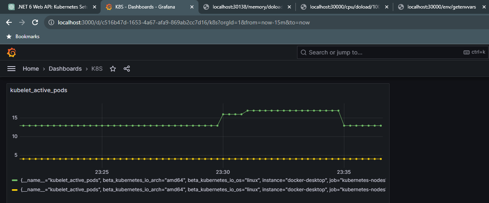

# PT_Demo_NET_Kubernetes


## Contents

- [Prerequisites](#prerequisites)
- Non-Helm Chart
  - [Setup](#setup)
  - [Add Horizontal Pod Autoscaling](#add-horizontal-pod-autoscaling-hpa)
- Helm Chart
  - [Using Helm Chart with HPA (CPU)](#using-helm-chart-with-hpa-cpu)
  - [Expand Helm Chart with HPA (CPU + Memory)](#expand-helm-chart-with-hpa-cpu--memory)
  - [Change Default Downscale Duration](#change-default-downscale-duration)
  - [Hardcode NodePort Port](#hardcode-nodeport-port)
  - [Rolling Updates and Rollbacks](#rolling-updates-and-rollbacks)
  - [Secrets and ConfigMaps](#secrets-and-configmaps)
  - [Grafana and Prometheus (Default Metrics)](#grafana-and-prometheus-default-metrics)
  - [Grafana and Prometheus (Custom Metrics)](#grafana-and-prometheus-custom-metrics)
- [Teardown](#teardown)
- [Commands](#commands)
  - [docker](#docker)
  - [kubectl](#kubectl)
  - [helm](#helm)
- [Terms](#terms)
- [Links](#links)

## Prerequisites

1. Install [Docker Desktop](https://www.docker.com/products/docker-desktop).

2. Enable `Kubernetes` in Docker Desktop:
```
Docker Desktop > Settings > Kubernetes > [✓] Enable Kubernetes
```

3. Make sure you have `kubectl` CLI by using any of the following commands:
```
kubectl version
kubectl --help
```

4. Install [Helm](https://helm.sh/docs/intro/install).

On Windows, open Power Shell `as Admin` and execute the following command:

```
choco install kubernetes-helm
```

5. Make sure you have `helm` CLI by using any of the following commands:
```
helm version
helm --help
```

## Setup

1. Create a new .NET blank solution `PT_Demo_NET_Kubernetes`.

2. Create a new .NET Web API project `DemoNetKubernetes` in the solution.

3. Introduce `CpuController` and `MemoryController` having endpoints which process CPU / Memory intensive operations.

4. Create `Dockerfile` in the DemoNetKubernetes.csproj directory:
```
FROM mcr.microsoft.com/dotnet/aspnet:6.0 AS base
WORKDIR /app
EXPOSE 80
EXPOSE 443

FROM mcr.microsoft.com/dotnet/sdk:6.0 AS build
WORKDIR /src
COPY ["DemoNetKubernetes.csproj", "./"]
RUN dotnet restore "DemoNetKubernetes.csproj"
COPY . .
WORKDIR "/src/"
RUN dotnet build "DemoNetKubernetes.csproj" -c Release -o /app/build

FROM build AS publish
RUN dotnet publish "DemoNetKubernetes.csproj" -c Release -o /app/publish

FROM base AS final
WORKDIR /app
COPY --from=publish /app/publish .
ENTRYPOINT ["dotnet", "DemoNetKubernetes.dll"]
```

5. Build `Docker Image` and push it to [Docker Hub](https://hub.docker.com/):

```
docker build -t petartotev/demonetkubernetes:latest .
docker push petartotev/demonetkubernetes:latest
```

6. Create a `/k8s` directory and add the following files:
- `deployment.yaml`
```
apiVersion: apps/v1
kind: Deployment
metadata:
  name: demonetkubernetes-deployment
spec:
  replicas: 2
  selector:
    matchLabels:
      app: demonetkubernetes
  template:
    metadata:
      labels:
        app: demonetkubernetes
    spec:
      containers:
      - name: demonetkubernetes
        image: petartotev/demonetkubernetes:latest
        ports:
        - containerPort: 80
```

- `service.yaml` - file for exposing the service using NodePort
```
apiVersion: v1
kind: Service
metadata:
  name: demonetkubernetes-service
spec:
  type: NodePort
  selector:
    app: demonetkubernetes
  ports:
    - protocol: TCP
      port: 80
      targetPort: 80
```

Apply `deployment.yaml` and `service.yaml` configurations:
```
kubectl apply -f deployment.yaml
kubectl apply -f service.yaml
```

8. Check the status of your service:
```
kubectl get service demonetkubernetes-service
```
Output:
```
NAME                        TYPE       CLUSTER-IP      EXTERNAL-IP   PORT(S)        AGE
demonetkubernetes-service   NodePort   10.102.113.24   <none>        80:31129/TCP   2m
```

9. Finally, get the external port** from PORT(S) and access the application using the following URL:
```
http://localhost:31129/cpu/doload/{number-of-operations}
```


** If you don't want for the external port to be a random number and you want to hardcode it, please check the [Hardcode NodePort Port
 section](#hardcode-nodeport-port) of this docs.

## Add Horizontal Pod Autoscaling (HPA)

Horizontal Pod Autoscaling (HPA) in Kubernetes allows you to automatically adjust the number of replica pods in a deployment based on observed CPU utilization or custom metrics.

0. All steps from the [Setup section](#setup) need to be accomplished before proceeding with this section.

1. Horizontal Pod Autoscaler relies on metrics provided by the `Metrics Server`.<br>Make sure it is installed and running in your cluster:

```
kubectl apply -f https://github.com/kubernetes-sigs/metrics-server/releases/latest/download/components.yaml
```

⚠️ WARNING: This step will later fail. Check steps 4-10 to see the whole story! 

2. Update existing `deployment.yaml` file created in the [Setup section](#setup) to include `resources, requests and limits for CPU`. This is necessary for HPA to work with CPU metrics:

```
apiVersion: apps/v1
kind: Deployment
metadata:
  name: demonetkubernetes-deployment
spec:
  replicas: 2
  selector:
    matchLabels:
      app: demonetkubernetes
  template:
    metadata:
      labels:
        app: demonetkubernetes
    spec:
      containers:
      - name: demonetkubernetes
        image: petartotev/demonetkubernetes:latest
        ports:
        - containerPort: 80
        resources:
          requests:
            cpu: "100m"
          limits:
            cpu: "500m"
```

Reapply `deployment.yaml` configuration:

```
kubectl apply -f deployment.yaml
```

3. Create `hpa.yaml` file with the following content:
```
apiVersion: autoscaling/v2beta2
kind: HorizontalPodAutoscaler
metadata:
  name: demonetkubernetes-hpa
spec:
  scaleTargetRef:
    apiVersion: apps/v1
    kind: Deployment
    name: demonetkubernetes-deployment
  minReplicas: 1  # Minimum number of pods
  maxReplicas: 5  # Maximum number of pods
  metrics:
  - type: Resource
    resource:
      name: cpu
      targetAverageUtilization: 50  # Adjust as needed based on your workload
```

Apply `hpa.yaml` configuration:

```
kubectl apply -f hpa.yaml
```

⚠️ WARNING: Failed to create resource!

<font color="red">Error from server (NotFound): error when creating "hpa.yaml": the server could not find the requested resource</font>

In order to fix this, update the `hpa.yaml` file as it follows:
```
apiVersion: autoscaling/v1
kind: HorizontalPodAutoscaler
metadata:
  name: demonetkubernetes-hpa
spec:
  scaleTargetRef:
    apiVersion: apps/v1
    kind: Deployment
    name: demonetkubernetes-deployment
  minReplicas: 1
  maxReplicas: 5
  targetCPUUtilizationPercentage: 50
```

Reapply `hpa.yaml` configuration:

```
kubectl apply -f hpa.yaml
```
✅ SUCCESS: Created resource!

Output:
```
horizontalpodautoscaler.autoscaling/demonetkubernetes-hpa created
```

4. Check the status of HPA:

```
kubectl get hpa
```
Output:
```
NAME                    REFERENCE                                 TARGETS         MINPODS   MAXPODS   REPLICAS   AGE
demonetkubernetes-hpa   Deployment/demonetkubernetes-deployment   <unknown>/50%   1         5         2          4m20s
```

⚠️ WARNING: TARGETS value `<unknown>/50%` is unexpected. The current CPU usage taken by `metrics-server` should have allegedly appeared there. It seems that `metrics-server` doesn't respond!

5. List all the `kube-systems`:

```
kubectl get pods -n kube-system
```

Output:
```
NAME                                     READY   STATUS    RESTARTS   AGE
coredns-5dd5756b68-dd7kj                 1/1     Running   0          39m
coredns-5dd5756b68-fvr6q                 1/1     Running   0          39m
etcd-docker-desktop                      1/1     Running   0          39m
kube-apiserver-docker-desktop            1/1     Running   0          39m
kube-controller-manager-docker-desktop   1/1     Running   0          39m
kube-proxy-9g5pr                         1/1     Running   0          39m
kube-scheduler-docker-desktop            1/1     Running   0          39m
metrics-server-fbb469ccc-w8s7x           0/1     Running   0          22m
storage-provisioner                      1/1     Running   0          39m
vpnkit-controller                        1/1     Running   0          39m
```

6. Check `metrics-server` logs:
```
kubectl logs -n kube-system metrics-server-fbb469ccc-w8s7x
```

⚠️ WARNING: The following issue occurs repetitively in logs:

<font color="red">I1212 22:22:11.887952       1 server.go:187] "Failed probe" probe="metric-storage-ready" err="no metrics to serve".
E1212 22:22:17.501977       1 scraper.go:140] "Failed to scrape node" err="Get \"https://192.168.65.3:10250/metrics/resource\": x509: cannot validate certificate for 192.168.65.3 because it doesn't contain any IP SANs" node="docker-desktop"</font>

💡 Check the following [github discussion](https://github.com/kubernetes-sigs/metrics-server/issues/1025):

<font color="cyan">Default metrics server configuration requires proper certificate configuration as documented in https://github.com/kubernetes-sigs/metrics-server#requirements.</font>

7. Delete ```metrics-server```:

```
kubectl delete pod -n kube-system <metrics-server-pod-name>
```

8. Download `components.yaml` file from step 1 and place it in the `/k8s` directory.
<br>Next, add `--kubelet-insecure-tls` arg in the Deployment section as follows:

```
---
apiVersion: apps/v1
kind: Deployment
metadata:
...
spec:
  ...
  template:
    metadata:
      ...
    spec:
      containers:
      - args:
        ...
        - --kubelet-insecure-tls
```
Apply `compontents.yaml` configuration:
```
kubectl apply -f components.yaml
```

Output:
```
serviceaccount/metrics-server unchanged
clusterrole.rbac.authorization.k8s.io/system:aggregated-metrics-reader unchanged
clusterrole.rbac.authorization.k8s.io/system:metrics-server unchanged
rolebinding.rbac.authorization.k8s.io/metrics-server-auth-reader unchanged
clusterrolebinding.rbac.authorization.k8s.io/metrics-server:system:auth-delegator unchanged
clusterrolebinding.rbac.authorization.k8s.io/system:metrics-server unchanged
service/metrics-server unchanged
deployment.apps/metrics-server configured
apiservice.apiregistration.k8s.io/v1beta1.metrics.k8s.io unchanged
```

9. Check `metrics-server` logs:

```
kubectl logs -n kube-system metrics-server-85cbcbdd74-zcg5j
```

Output:
```
I1212 22:56:31.842909       1 serving.go:342] Generated self-signed cert (/tmp/apiserver.crt, /tmp/apiserver.key)
I1212 22:56:32.145685       1 requestheader_controller.go:169] Starting RequestHeaderAuthRequestController
I1212 22:56:32.145716       1 dynamic_serving_content.go:131] "Starting controller" name="serving-cert::/tmp/apiserver.crt::/tmp/apiserver.key"
I1212 22:56:32.145728       1 shared_informer.go:240] Waiting for caches to sync for RequestHeaderAuthRequestController
I1212 22:56:32.145769       1 configmap_cafile_content.go:201] "Starting controller" name="client-ca::kube-system::extension-apiserver-authentication::client-ca-file"
I1212 22:56:32.145784       1 shared_informer.go:240] Waiting for caches to sync for client-ca::kube-system::extension-apiserver-authentication::client-ca-file
I1212 22:56:32.145772       1 configmap_cafile_content.go:201] "Starting controller" name="client-ca::kube-system::extension-apiserver-authentication::requestheader-client-ca-file"
I1212 22:56:32.145799       1 shared_informer.go:240] Waiting for caches to sync for client-ca::kube-system::extension-apiserver-authentication::requestheader-client-ca-file
I1212 22:56:32.145690       1 secure_serving.go:267] Serving securely on [::]:4443
W1212 22:56:32.145910       1 shared_informer.go:372] The sharedIndexInformer has started, run more than once is not allowed
I1212 22:56:32.145705       1 tlsconfig.go:240] "Starting DynamicServingCertificateController"
I1212 22:56:32.246369       1 shared_informer.go:247] Caches are synced for RequestHeaderAuthRequestController
I1212 22:56:32.246457       1 shared_informer.go:247] Caches are synced for client-ca::kube-system::extension-apiserver-authentication::requestheader-client-ca-file
I1212 22:56:32.246466       1 shared_informer.go:247] Caches are synced for client-ca::kube-system::extension-apiserver-authentication::client-ca-file
```

✅ SUCCESS: `Metrics-server` is now working properly.

10. Check the status of HPA:

```
kubectl get hpa
```

Output:
```
NAME                    REFERENCE                                 TARGETS   MINPODS   MAXPODS   REPLICAS   AGE
demonetkubernetes-hpa   Deployment/demonetkubernetes-deployment   1%/50%    1         5         1          14m
```

✅ SUCCESS: TARGETS is not `<unknown>/50%` anymore - it has a value of `1%/50%`, taken from the metrics of the running pods.

11. Test

Before, there was only 1 pod due to HPA (`minReplicas: 1`):


Push CPU usage by calling the CPU-intensive endpoint:
```
http://localhost:31129/cpu/doload/100000000
http://localhost:31129/cpu/doload/2147483646
```

Now, HPA increased the number of pods to 5 (`maxReplicas: 5`):


## Using Helm Chart with HPA (CPU)

0. Reset the Kubernetes Cluster by following the instructions in the [Teardown section](#teardown)

1. Apply `components.yaml` configuration created in the [HPA section](#add-horizontal-pod-autoscaling-hpa):

```
kubectl apply -f ./k8s/components.yaml
```

Output:
```
serviceaccount/metrics-server created
clusterrole.rbac.authorization.k8s.io/system:aggregated-metrics-reader created
clusterrole.rbac.authorization.k8s.io/system:metrics-server created
rolebinding.rbac.authorization.k8s.io/metrics-server-auth-reader created
clusterrolebinding.rbac.authorization.k8s.io/metrics-server:system:auth-delegator created
clusterrolebinding.rbac.authorization.k8s.io/system:metrics-server created
service/metrics-server created
deployment.apps/metrics-server created
apiservice.apiregistration.k8s.io/v1beta1.metrics.k8s.io created
```

2. Create new `Helm Chart` in the parent directory:

```
helm create helm-chart
cd helm-chart
```

3. Delete all content from `values.yaml` and replace it with:

```
# helm-chart/values.yaml

replicaCount: 1

image:
  repository: k8s.gcr.io/metrics-server/metrics-server
  tag: v0.5.0  # Replace with the desired version
  pullPolicy: IfNotPresent

service:
  type: NodePort
  port: 80
  targetPort: 80

autoscaling:
  enabled: true
  minReplicas: 2
  maxReplicas: 5
  targetCPUUtilizationPercentage: 50
```

4. Remove all existing content from `/templates` folder and create the following files (see the finalized content of the files in `./helm-chart/templates`):

- deployment.yaml
- service.yaml
- hpa.yaml

5. Install the `Helm Chart`:
```
helm install demo-release ./helm-chart
```

Output:
```
NAME: demo-release
LAST DEPLOYED: Wed Dec 13 16:47:42 2023
NAMESPACE: default
STATUS: deployed
REVISION: 1
TEST SUITE: None
```

Note that for every running Pod Helm runs an internal Pod along with it:
```
k8s_POD_demo-release-helm-...: This is a standard Kubernetes pod naming convention where demo-release-helm-... is the name of your pod.

k8s_helm_demo-release-helm-...: The prefix "helm" indicates that this pod may be related to Helm's internal management. Helm often deploys pods with names containing the release name and a unique identifier.
```

6. Check the status of HPA:

```
kubectl get hpa
```

Output:
```
NAME                REFERENCE                      TARGETS         MINPODS   MAXPODS   REPLICAS   AGE
demo-release-helm   Deployment/demo-release-helm   <unknown>/50%   1         5         1          4m25s
```

⚠️ WARNING: TARGETS value `<unknown>/50%` is unexpected. The current CPU usage taken by `metrics-server` should have allegedly appeared there. It seems that `metrics-server` doesn't respond!

7. Verify that `HPA` is correctly configured to use metrics provided by Metrics Server:

```
kubectl describe hpa demo-release-helm
```

Output:
```
Name:                                                  demo-release-helm
Namespace:                                             default
Labels:                                                app=helm
                                                       app.kubernetes.io/managed-by=Helm
Annotations:                                           meta.helm.sh/release-name: demo-release
                                                       meta.helm.sh/release-namespace: default
CreationTimestamp:                                     Wed, 13 Dec 2023 17:08:09 +0200
Reference:                                             Deployment/demo-release-helm
Metrics:                                               ( current / target )
  resource cpu on pods  (as a percentage of request):  <unknown> / 50%
Min replicas:                                          1
Max replicas:                                          5
Deployment pods:                                       1 current / 0 desired
Conditions:
  Type           Status  Reason                   Message
  ----           ------  ------                   -------
  AbleToScale    True    SucceededGetScale        the HPA controller was able to get the target's current scale
  ScalingActive  False   FailedGetResourceMetric  the HPA was unable to compute the replica count: failed to get cpu utilization: missing request for cpu in container helm of Pod demo-release-helm-56fcc7bd5b-xj9n8
Events:
  Type     Reason                        Age                  From                       Message
  ----     ------                        ----                 ----                       -------
  Warning  FailedGetResourceMetric       38s (x4 over 3m38s)  horizontal-pod-autoscaler  failed to get cpu utilization: missing request for cpu in container helm of Pod demo-release-helm-56fcc7bd5b-xj9n8
  Warning  FailedComputeMetricsReplicas  38s (x4 over 3m38s)  horizontal-pod-autoscaler  invalid metrics (1 invalid out of 1), first error is: failed to get cpu resource metric value: failed to get cpu utilization: missing request for cpu in container helm of Pod demo-release-helm-56fcc7bd5b-xj9n8
```

8. Edit `/templates/deployment.yaml` file and by adding the following:
```
containers:
  - name: {{ .Chart.Name }}
    image: "{{ .Values.image.repository }}:{{ .Values.image.tag }}"
    ports:
      - containerPort: 80
    resources:
      requests:
        cpu: 100m
```

9. Reinstall the `Helm Chart`:

```
helm upgrade demo-release ./helm-demo
```

10. Test

Before, there was only 1 pod due to HPA (`minReplicas: 1`).

Push CPU usage by calling the CPU-intensive endpoint:

```
http://localhost:31129/cpu/doload/100000000
```

Now, HPA increased the number of pods to 5 (`maxReplicas: 5`).

## Expand Helm Chart with HPA (CPU + Memory)

0. Do all steps from the previous section.

1. Update `resources` section of `deployment.yaml` in `/templates` to include `memory` requests value:

```
# helm-chart/templates/deployment.yaml

apiVersion: apps/v1
kind: Deployment
metadata:
  ...
spec:
  ...
  template:
    ...
    spec:
      containers:
        - name: {{ .Chart.Name }}
          image: "{{ .Values.image.repository }}:{{ .Values.image.tag }}"
          ports:
            - containerPort: 80
          resources:
            requests:
              cpu: 100m
              memory: 128Mi
```

2. Update `values.yaml`:

```
...
autoscaling:
  enabled: true
  minReplicas: 1
  maxReplicas: 5
  targetCPUUtilizationPercentage: 50
  targetMemoryUtilizationPercentage: 50
```

3. Update `hpa.yaml`:

```
...
spec:
  scaleTargetRef:
    apiVersion: apps/v1
    kind: Deployment
    name: {{ .Release.Name }}-{{ .Chart.Name }}
  minReplicas: {{ .Values.autoscaling.minReplicas }}
  maxReplicas: {{ .Values.autoscaling.maxReplicas }}
  targetCPUUtilizationPercentage: {{ .Values.autoscaling.targetCPUUtilizationPercentage }}
  targetMemoryUtilizationPercentage: {{ .Values.autoscaling.targetMemoryUtilizationPercentage }}
```

4. Upgrade Helm Chart:

```
helm upgrade demo-release ./helm-demo
```

5. Check the status of HPA:

```
kubectl get hpa
```

6. Describe the HPA to see if there are any events that provide information about the HPA's decision-making process:

```
kubectl describe hpa <hpa-name>
```

7. Test

Push Memory usage by calling the Memory-intensive endpoint a few times:
```
http://localhost:31348/memory/doload/10000
```

Before, there was only 1 pod due to HPA (`minReplicas: 1`):


Now, HPA increased the number of pods to 5 (`maxReplicas: 5`):


## Change Default Downscale Duration

If not explicitly defined in .YAML-s, the default downscaleStabilizationDurationSeconds is set to 300 seconds.
In order to change this default value, you need to introduce the following changes:

1. Change `hpa.yaml`:

```
...
  ...
spec:
  ...
  targetCPUUtilizationPercentage: {{ .Values.autoscaling.targetCPUUtilizationPercentage }}
  targetMemoryUtilizationPercentage: {{ .Values.autoscaling.targetMemoryUtilizationPercentage }}
  downscaleStabilizationDurationSeconds: {{ .Values.autoscaling.downscaleStabilizationDurationSeconds }} # if not explicitly defined, default is 300 seconds.
```

2. Change `values.yaml`:

```
# helm-demo/values.yaml

replicaCount: 1

image:
  ...

service:
  ...

autoscaling:
  ...
  targetCPUUtilizationPercentage: 50
  targetMemoryUtilizationPercentage: 50
  downscaleStabilizationDurationSeconds: 180
```

3. Upgrade Helm Chart:

```
helm upgrade demo-release ./helm-demo
```

4. Test

## Hardcode NodePort Port

Every time you upgrade the Helm Chart and restart it, a new random port will be assigned for the NodePort declared in `service.yaml`.

In order to hardcode it, introduce the following changes:

1. Change `service.yaml`:

```
apiVersion: v1
kind: Service
metadata:
  ...
spec:
  type: {{ .Values.service.type }}
  ports:
    - port: {{ .Values.service.port }}
      targetPort: {{ .Values.service.targetPort }}
      nodePort: {{ .Values.service.nodePort }}  # Specify the external port number here
  ...
```

2. Change `values.yaml`:

```
replicaCount: 1

image:
  ...

service:
  type: NodePort
  port: 80
  targetPort: 80
  nodePort: 30000 # Hardcode the nodePort value to 30000!

autoscaling:
  ...
```

3. Upgrade Helm Chart:

```
helm upgrade demo-release ./helm-demo
```

4. Test

## Rolling Updates and Rollbacks

1. Create version 1.0 of your Docker image:

```
docker build -t petartotev/demonetkubernetes:latest .
docker tag petartotev/demonetkubernetes:latest petartotev/demonetkubernetes:v1.0
docker push petartotev/demonetkubernetes:v1.0
```

2. Run `metrics server`:

```
kubectl apply -f ./k8s/components.yaml
```

3. Update `values.yaml` in order to use version `v1.0`:

```
image:
  repository: petartotev/demonetkubernetes
  tag: v1.0  # Replace with the desired tag
```

4. Helm install:

```
helm install demo-release ./helm-chart
```

5. Create version 1.1 of your Docker image:

```
docker build -t petartotev/demonetkubernetes:latest .
docker tag petartotev/demonetkubernetes:latest petartotev/demonetkubernetes:v1.1
docker push petartotev/demonetkubernetes:v1.1
```

6. Update `values.yaml` in order to use version `v1.1`:

```
image:
  repository: petartotev/demonetkubernetes
  tag: v1.1  # Replace with the desired tag
```

7. Helm upgrade:

```
helm upgrade demo-release ./helm-demo
```

8. Observe how `rolling update` is working in Docker Desktop...

✅ SUCCESS

9. In order to test Rollbacks, bring back version v1.0 in `values.yaml`:

```
image:
  repository: petartotev/demonetkubernetes
  tag: v1.0  # Replace with the desired tag
```

10. Helm upgrade once more:

```
helm upgrade demo-release ./helm-demo
```

11. Observe how `rollback` is working in Docker Desktop...

✅ SUCCESS

## Secrets and ConfigMaps

1. Create a `Secret` to store sensitive information, such as database credentials in a new `secrets.yaml` file in the `/templates` directory:

```
# helm-chart/templates/secrets.yaml

apiVersion: v1
kind: Secret
metadata:
  name: my-secret
type: Opaque
data:
  database-password: BASE64_ENCODED_PASSWORD
```

2. Create a `ConfigMap` to store configuration data that the application may need in a new `configmaps.yaml` file in the `/templates` directory:

```
# helm-chart/templates/configmaps.yaml

apiVersion: v1
kind: ConfigMap
metadata:
  name: my-configmap
data:
  app-config: |
    exampleKey: exampleValue
```

3. Update `deployments.yaml`:

```
          env:
            - name: DATABASE_PASSWORD
              valueFrom:
                secretKeyRef:
                  name: my-secret
                  key: database-password
            - name: APP_CONFIG
              valueFrom:
                configMapKeyRef:
                  name: my-configmap
                  key: app-config
```

4. Introduce new [GET] endpoint in the .NET application in order to "print" the values set in `secrets.yaml` and `configmaps.yaml`.
<br>You can later call the endpoint at:

```
http://localhost:30000/env/getenvvars
```

5. Build a new Image and push it to Docker Hub:

```
docker build -t petartotev/demonetkubernetes:latest .
docker push petartotev/demonetkubernetes:latest
```

6. Uninstall the Helm Chart and install it from scratch:

```
helm uninstall demo-release
helm install demo-release ./helm-chart
```

7. Make sure that the environment variables are set in the deployment environment. You can use the following command in a terminal to check if the environment variables are available:

```
kubectl get pods
kubectl exec -it <pod-name> -- printenv
```

Output:
```
PATH=/usr/local/sbin:/usr/local/bin:/usr/sbin:/usr/bin:/sbin:/bin
HOSTNAME=demo-release-helm-68d7dff6f-kvds6
TERM=xterm
DATABASE_PASSWORD=this-is-my-super-secret-connection-string
APP_CONFIG=exampleKey: exampleValue

KUBERNETES_SERVICE_HOST=10.96.0.1
KUBERNETES_SERVICE_PORT=443
KUBERNETES_PORT_443_TCP=tcp://10.96.0.1:443
DEMO_RELEASE_HELM_PORT_80_TCP=tcp://10.100.142.193:80
DEMO_RELEASE_HELM_PORT_80_TCP_ADDR=10.100.142.193
KUBERNETES_PORT=tcp://10.96.0.1:443
KUBERNETES_PORT_443_TCP_PORT=443
KUBERNETES_PORT_443_TCP_ADDR=10.96.0.1
DEMO_RELEASE_HELM_PORT_80_TCP_PROTO=tcp
DEMO_RELEASE_HELM_SERVICE_PORT=80
KUBERNETES_SERVICE_PORT_HTTPS=443
DEMO_RELEASE_HELM_SERVICE_HOST=10.100.142.193
DEMO_RELEASE_HELM_PORT_80_TCP_PORT=80
KUBERNETES_PORT_443_TCP_PROTO=tcp
DEMO_RELEASE_HELM_PORT=tcp://10.100.142.193:80
ASPNETCORE_URLS=http://+:80
DOTNET_RUNNING_IN_CONTAINER=true
DOTNET_VERSION=6.0.25
ASPNET_VERSION=6.0.25
HOME=/root
```

8. You can also verify that your Helm values (from values.yaml) are being applied correctly. You can inspect the Helm release to see the applied values:

```
helm get values demo-release
```

Output:
```
USER-SUPPLIED VALUES:
null
```

9. Test by calling the [GET] endpoint:

```
http://localhost:30000/env/getenvvars
```


## Grafana and Prometheus (Default Metrics)

0. Reset Kubernetes Cluster by doing all the steps described in the [Teardown section](#teardown).

1. Apply `metrics-server`:

```
kubectl apply -f ./k8s/components.yaml
```

Output:
```
serviceaccount/metrics-server created
clusterrole.rbac.authorization.k8s.io/system:aggregated-metrics-reader created
clusterrole.rbac.authorization.k8s.io/system:metrics-server created
rolebinding.rbac.authorization.k8s.io/metrics-server-auth-reader created
clusterrolebinding.rbac.authorization.k8s.io/metrics-server:system:auth-delegator created
clusterrolebinding.rbac.authorization.k8s.io/system:metrics-server created
service/metrics-server created
deployment.apps/metrics-server created
apiservice.apiregistration.k8s.io/v1beta1.metrics.k8s.io created
```

2. Install Helm Chart:

```
helm install helm-demo ./helm-chart
```

Output:
```
W1219 09:36:59.028935    6308 warnings.go:70] unknown field "spec.downscaleStabilizationDurationSeconds"
W1219 09:36:59.029726    6308 warnings.go:70] unknown field "spec.targetMemoryUtilizationPercentage"
NAME: helm-demo
LAST DEPLOYED: Tue Dec 19 09:36:58 2023
NAMESPACE: default
STATUS: deployed
REVISION: 1
TEST SUITE: None
```

3. Add prometheus and grafana repos:

```
helm repo add prometheus-community https://prometheus-community.github.io/helm-charts
helm repo add grafana https://grafana.github.io/helm-charts
```

Output:
```
"prometheus-community" has been added to your repositories
"grafana" has been added to your repositories
```

4. Install `prometheus`:

```
helm install prometheus prometheus-community/prometheus
```

Output:
```
NAME: prometheus
LAST DEPLOYED: Fri Dec 15 21:41:55 2023
NAMESPACE: default
STATUS: deployed
REVISION: 1
TEST SUITE: None
NOTES:
The Prometheus server can be accessed via port 80 on the following DNS name from within your cluster:
prometheus-server.default.svc.cluster.local

Get the Prometheus server URL by running these commands in the same shell:
  export POD_NAME=$(kubectl get pods --namespace default -l "app.kubernetes.io/name=prometheus,app.kubernetes.io/instance=prometheus" -o jsonpath="{.items[0].metadata.name}")
  kubectl --namespace default port-forward $POD_NAME 9090

The Prometheus alertmanager can be accessed via port 9093 on the following DNS name from within your cluster:
prometheus-alertmanager.default.svc.cluster.local

Get the Alertmanager URL by running these commands in the same shell:
  export POD_NAME=$(kubectl get pods --namespace default -l "app.kubernetes.io/name=alertmanager,app.kubernetes.io/instance=prometheus" -o jsonpath="{.items[0].metadata.name}")
  kubectl --namespace default port-forward $POD_NAME 9093
#################################################################################
######   WARNING: Pod Security Policy has been disabled by default since    #####
######            it deprecated after k8s 1.25+. use                        #####
######            (index .Values "prometheus-node-exporter" "rbac"          #####
###### .          "pspEnabled") with (index .Values                         #####
######            "prometheus-node-exporter" "rbac" "pspAnnotations")       #####
######            in case you still need it.                                #####
#################################################################################

The Prometheus PushGateway can be accessed via port 9091 on the following DNS name from within your cluster:
prometheus-prometheus-pushgateway.default.svc.cluster.local

Get the PushGateway URL by running these commands in the same shell:
  export POD_NAME=$(kubectl get pods --namespace default -l "app=prometheus-pushgateway,component=pushgateway" -o jsonpath="{.items[0].metadata.name}")
  kubectl --namespace default port-forward $POD_NAME 9091

For more information on running Prometheus, visit:
https://prometheus.io/
```

5. (Optional) Get `prometheus-server` Pod ID:

```
kubectl get pods --all-namespaces
```

6. (Optional) Port-forward `prometheus-server`:

```
kubectl port-forward prometheus-server-6b68fbd54b-82c42 9090:9090
```

Output:

```
Forwarding from 127.0.0.1:9090 -> 9090
Forwarding from [::1]:9090 -> 9090
Handling connection for 9090
Handling connection for 9090
...
```

7. (Optional) Access Prometheus on [http://localhost:9090](http://localhost:9090) and check its `Targets` (Status > Targets):


8. Install `grafana`:

```
helm install grafana grafana/grafana
```

Output:
```
NAME: grafana
LAST DEPLOYED: Fri Dec 15 21:43:30 2023
NAMESPACE: default
STATUS: deployed
REVISION: 1
NOTES:
1. Get your 'admin' user password by running:

   kubectl get secret --namespace default grafana -o jsonpath="{.data.admin-password}" | base64 --decode ; echo


2. The Grafana server can be accessed via port 80 on the following DNS name from within your cluster:

   grafana.default.svc.cluster.local

   Get the Grafana URL to visit by running these commands in the same shell:
     export POD_NAME=$(kubectl get pods --namespace default -l "app.kubernetes.io/name=grafana,app.kubernetes.io/instance=grafana" -o jsonpath="{.items[0].metadata.name}")
     kubectl --namespace default port-forward $POD_NAME 3000

3. Login with the password from step 1 and the username: admin
#################################################################################
######   WARNING: Persistence is disabled!!! You will lose your data when   #####
######            the Grafana pod is terminated.                            #####
#################################################################################
```

9. Expose `grafana` service at port 3000:

```
kubectl expose service grafana --type=NodePort --target-port=3000 --name=grafana-nodeport
```

Output:
```
service/grafana-nodeport exposed
```

10. Get grafana pods:

```
kubectl get pods -l "app.kubernetes.io/name=grafana"
```

Output:
```
NAME                       READY   STATUS    RESTARTS   AGE
grafana-674c48c8cd-rvdf9   1/1     Running   0          23m
```

11. Port forward on 3000:3000:

```
kubectl port-forward grafana-674c48c8cd-rvdf9 3000:3000
```

Output:
```
Forwarding from 127.0.0.1:3000 -> 3000
Forwarding from [::1]:3000 -> 3000
Handling connection for 3000
Handling connection for 3000
...
```

12. Run the following command in PowerShell in order to retrieve the Grafana UI login password:

```
kubectl get secret --namespace default grafana -o jsonpath="{.data.admin-password}" | ForEach-Object { [System.Text.Encoding]::UTF8.GetString([System.Convert]::FromBase64String($_)) }
```

Output:
```
123WsRPHe123eTUjLy123AMBXIFVkelHMdkZg123
```

13. Access Grafana on [http://localhost:3000/](http://localhost:3000/) and login:
```
Email or username: admin
Password: 123WsRPHe123eTUjLy123AMBXIFVkelHMdkZg123
```

14. Add Prometheus as a data source:

- Navigate to "Settings" > "Connections" > "Data Sources" > "Add your first data source."
- Choose Prometheus.
- Set the URL to http://prometheus-server:80

15. Build a Dashboard:

- Add a Visualization
- Select Data Source: Prometheus
- Kick start your query
- Choose `kubelet_active_pods`
- [Run queries] > [Apply]



## Grafana and Prometheus (Custom Metrics)

0. Do all steps from the [Grafana and Prometheus ](#grafana-and-prometheus-default-metrics) section above!

1. In the .NET Application, install `prometheus-net` and `prometheus-net.AspNetCore` NuGet packages.

2. In `CpuController`, implement the following:

```
[HttpGet(Name = "DoLoadOnCpu")]
[Route("doload/{number}")]
public ObjectResult Get(int number)
{
    ...

    var counter = Metrics.CreateCounter(
        "cpu_endpoint_requests_count",
        "cpu_endpoint_requests_count gets incremented on requests upon CPU endpoints.");
    counter.Inc();

    return Ok(...);
}
```

3. (Optional) For the sake of sanity check, you can go to Prometheus > Status > Targets and check the Targets:


4. (Optional) Make a [POST] request using Postman - it should return `200 OK` with no response body:
```
[POST] http://localhost:9090/-/reload
```

5. Introduce new `prometheus-values.yaml` file in the parent Helm Chart directory (./helm-chart), where the `values.yaml` file is:

```
serverFiles:
  prometheus.yml:
    scrape_configs:
      - job_name: 'dotnet-app' # target-name-used-by-prometheus
        static_configs:
          - targets: ['helm-demo-helm:80'] # dotnet-app-pod-name:target-port
```

6. Helm Upgrade Prometheus:

```
helm upgrade prometheus prometheus-community/prometheus -f ./helm-chart/prometheus-values.yaml
```

7. Check if the new Target was successfully added in Prometheus UI on `localhost:9090` (Status > Targets):


⚠️💡 WARNING: Prometheus UI could show that you didn't get the `dotnet-app` Target as expected after executing `helm upgrade`.

If so, try the following steps:

- Make a request using Postman: ```[POST] http://localhost:9090/-/reload```. <br>This would allegedly return `200 OK` with no response body.

- Update the `prometheus-values.yaml` file by adding `http://` in the targets:

```
serverFiles:
  prometheus.yml:
    scrape_configs:
      - job_name: 'dotnet-app' # target-name-used-by-prometheus
        static_configs:
          - targets: ['http://helm-demo-helm:80'] # dotnet-app-pod-name:target-port
```

- Execute `helm upgrade` again:

```
helm upgrade prometheus prometheus-community/prometheus -f ./helm-chart/prometheus-values.yaml
```

- Make a request using Postman: ```[POST] http://localhost:9090/-/reload```. <br>This would allegedly return `500 Internal Server Error` with the following response body:

```
failed to reload config: couldn't load configuration (--config.file="/etc/config/prometheus.yml"): parsing YAML file /etc/config/prometheus.yml: "http://helm-demo-helm:80" is not a valid hostname
```

- Update the `prometheus-values.yaml` file by removing `http://` from the targets:

```
serverFiles:
  prometheus.yml:
    scrape_configs:
      - job_name: 'dotnet-app' # target-name-used-by-prometheus
        static_configs:
          - targets: ['helm-demo-helm:80'] # dotnet-app-pod-name:target-port
```

- Make a request using Postman: ```[POST] http://localhost:9090/-/reload```. <br>This would allegedly return `200 OK` with no response body.

- Check Prometheus UI > Status > Targets - it would allegedly contain `dotnet-app` Target.

✅ SUCCESS

8. Go to Grafana UI and create new Visualization including the introduced metrics in the .NET Application (e.g. cpu_endpoint_requests_count):


## Teardown

1. In order to reset the K8S cluster, you can do any of the following:
- Go to Docker > Settings > Kubernetes > [Reset Kubernetes Cluster]


- Try to remove the Kubernetes infrastructure manually by using the following command:
```
kubectl delete deployments,services --all
```

2. In case you have `helm repos` added, you can list them:

```
helm repo list
```

Output:
```
NAME                    URL
prometheus-community    https://prometheus-community.github.io/helm-charts
grafana                 https://grafana.github.io/helm-charts
```

3. If any, you can delete them:

```
helm repo remove prometheus-community
helm repo remove grafana
```

Output:
```
"prometheus-community" has been removed from your repositories
"grafana" has been removed from your repositories
```

## Commands

### docker
```docker build -t user/projectname:latest .```  
```docker push user/projectname:latest```  

```docker build -t petartotev/demonetkubernetes:latest .```  
```docker tag petartotev/demonetkubernetes:latest petartotev/demonetkubernetes:v1.0```  
```docker push petartotev/demonetkubernetes:v1.0```  

### kubectl
```kubectl apply -f deployment.yaml```

```kubectl apply -f service.yaml```  
```kubectl get services```  
```kubectl get service projectname-service```  

```kubectl apply -f hpa.yaml```  
```kubectl get hpa```  
```kubectl describe hpa```  

```kubectl describe pod <pod-name>```  
```kubectl exec -it <pod-name> -- printenv```

```kubectl describe deployment <deployment-name>```  

```kubectl get pods -n kube-system```  
```kubectl logs -n kube-system metrics-server-fbb469ccc-w8s7x```  
```kubectl delete pod -n kube-system <metrics-server-pod-name>```  

```kubectl delete deployments,services --all```  

### helm
```helm create helm-chart```  

```helm install demo-release ./helm-chart```  
```helm upgrade demo-release ./helm-demo```  
```helm uninstall demo-release```  

```helm get values demo-release```  

```helm repo add prometheus-community https://prometheus-community.github.io/helm-charts```  
```helm repo add grafana https://grafana.github.io/helm-charts```  

```helm install prometheus prometheus-community/prometheus```  
```helm install prometheus prometheus-community/prometheus -f ./helm-chart/values.yaml```  
```helm install grafana grafana/grafana```  

```helm repo update```  
```helm repo list```  

```helm repo remove prometheus-community```  
```helm repo remove grafana```  


## Terms
- [Helm](https://helm.sh/docs/) = the package manager for Kubernetes

## Links
- https://forums.docker.com/t/unable-to-install-kubernetes-stuck-on-starting-state/117048
- https://github.com/kubernetes-sigs/metrics-server/issues/1025
- https://github.com/kubernetes-sigs/metrics-server#requirements
- https://stackoverflow.com/questions/59448042/kubernetes-hpa-deployment-cannot-find-target-resource